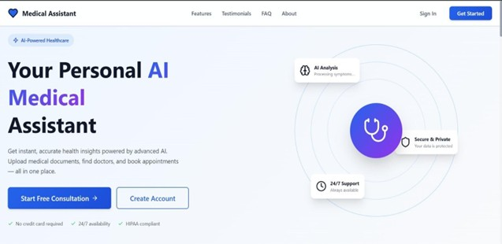
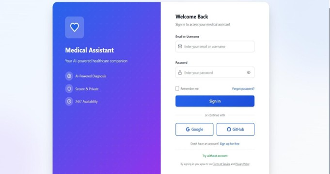
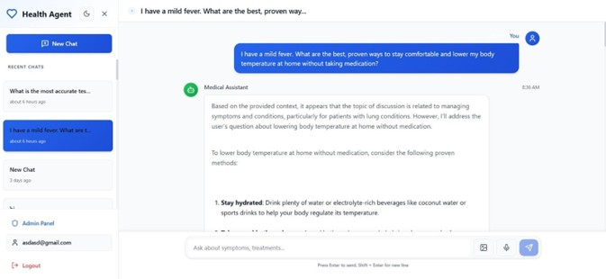
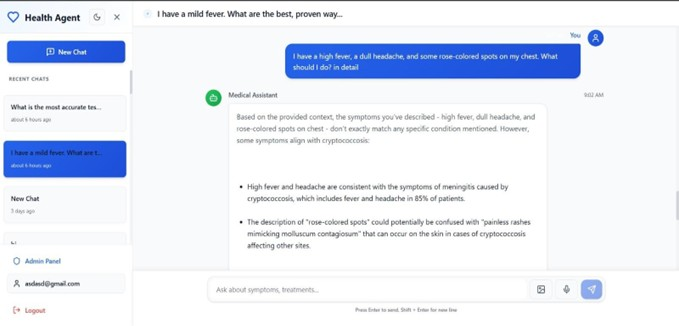
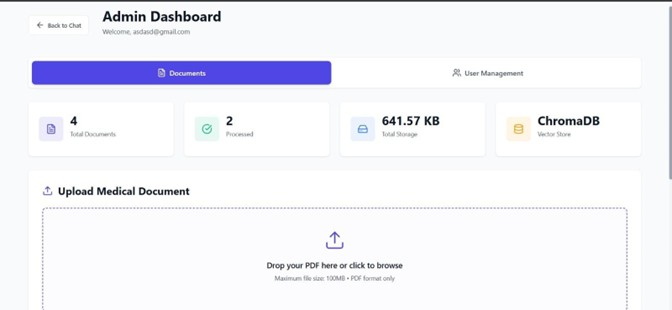
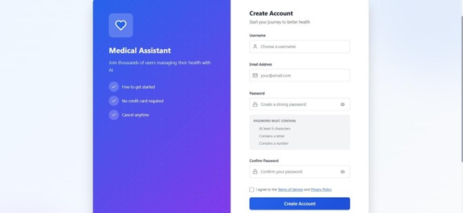

# Health Agent: An Artificial Intelligence Integrated Healthcare Assistant


A full-stack medical assistant application with RAG (Retrieval-Augmented Generation) capabilities, appointment booking and web search integration.

---

## 📑 Table of Contents

- [Features](#features)
- [Tech Stack](#tech-stack)
- [Setup Instructions](#setup-instructions)
- [Quick Start Scripts](#quick-start-scripts)
- [Default Users](#default-users)
- [API Endpoints](#api-endpoints)
- [Project Structure](#project-structure)
- [Features Guide](#features-guide)
- [Screenshots](#-screenshots)
- [Troubleshooting](#troubleshooting)
- [Environment Variables](#environment-variables)
- [License](#license)
- [Author](#-author)

---

## Features

- 🤖 **AI Medical Assistant** - Get answers to medical questions using RAG and Google's Gemini AI
- 📅 **Appointment Booking** - Book appointments with doctors (simulation)
- 🔍 **Web Search** - Find doctors, clinics and hospitals using Tavily search
- 📄 **Document Upload** - Admin can upload medical documents for the RAG system
- 💬 **Chat Sessions** - Manage multiple chat sessions with history
- 👥 **User Authentication** - Secure login and signup
- 🎯 **Guest Mode** - Try the assistant without creating an account

## Tech Stack

### Backend
- FastAPI (Python web framework)
- SQLAlchemy (ORM)
- LangGraph (AI agent orchestration)
- Google Gemini AI (LLM)
- ChromaDB (Vector database)
- Tavily API (Web search)

### Frontend
- React 18
- Vite
- React Router
- Axios
- Lucide React (Icons)
- React Markdown

## Setup Instructions

### Prerequisites
- Python 3.12 (already installed with mediassis virtual environment)
- Node.js 18+ and npm
- API Keys:
  - Google AI API Key (https://makersuite.google.com/app/apikey)
  - Tavily API Key (https://tavily.com/)

### Backend Setup

1. **Activate the virtual environment:**
   ```bash
   cd backend
   .\mediassis\Scripts\activate
   ```

2. **Configure environment variables:**
   - Edit `backend\.env` file and add your API keys:
   ```env
   GOOGLE_API_KEY=your-google-api-key-here
   TAVILY_API_KEY=your-tavily-api-key-here
   ```

3. **Run the backend server:**
   ```bash
   python -m app.main
   ```
   The API will be available at http://localhost:8009
   API Documentation: http://localhost:8009/docs

### Frontend Setup

1. **Install dependencies (if not already installed):**
   ```bash
   cd frontend
   npm install
   ```

2. **Run the development server:**
   ```bash
   npm run dev
   ```
   The app will be available at http://localhost:3000

## Quick Start Scripts

For easier startup, use the provided scripts:

### Windows
```bash
# Start Backend
.\start-backend.bat

# Start Frontend
.\start-frontend.bat
```

### Linux/Mac
```bash
# Start Backend
./start-backend.sh

# Start Frontend
./start-frontend.sh
```

## Default Users

For testing, you can create a new account or use:
- **Role**: User (default)
- **Admin**: Create an account and manually set `is_admin=true` in the database

## API Endpoints

### Authentication
- `POST /api/auth/signup` - Register new user
- `POST /api/auth/login` - Login
- `GET /api/auth/me` - Get current user

### Chat
- `POST /api/chat/{session_id}/message` - Send message
- `POST /api/chat/{session_id}/stream` - Stream message response
- `GET /api/chat/{session_id}/messages` - Get chat history

### Sessions
- `POST /api/sessions/` - Create new session
- `GET /api/sessions/` - Get all sessions
- `GET /api/sessions/{id}` - Get session details
- `DELETE /api/sessions/{id}` - Delete session

### Admin
- `POST /api/admin/upload` - Upload medical documents
- `GET /api/admin/documents` - Get all documents
- `DELETE /api/admin/documents/{id}` - Delete document

### Guest
- `POST /api/guest/chat` - Chat without authentication

## Project Structure

```
medical-assistant-app/
├── backend/
│   ├── app/
│   │   ├── api/          # API routes
│   │   ├── core/         # Core functionality (RAG, security)
│   │   ├── models/       # Database models
│   │   ├── schemas/      # Pydantic schemas
│   │   ├── services/     # Business logic
│   │   └── main.py       # Application entry point
│   ├── mediassis/        # Virtual environment
│   ├── uploads/          # Uploaded documents
│   ├── chroma_db/        # Vector database
│   └── .env              # Environment variables
├── frontend/
│   ├── src/
│   │   ├── components/   # React components
│   │   ├── context/      # React context
│   │   ├── services/     # API services
│   │   └── main.jsx      # Application entry point
│   └── package.json
├── images/                # Screenshots used in this README
└── README.md
```

## Features Guide

### For Users
1. **Sign up** for an account or try **Guest Mode**
2. **Ask medical questions** - The AI will use RAG to provide accurate answers
3. **Find doctors** - Search for healthcare providers in your city
4. **Book appointments** - Schedule appointments with doctors
5. **Manage chats** - Create multiple chat sessions and view history

### For Admins
1. **Upload documents** - Add medical PDFs to enhance the RAG system
2. **Manage documents** - View and delete uploaded documents
3. **Monitor system** - All admin features accessible from the dashboard

---

## 📸 Screenshots


### Main Dashboard


### Login Page


### Guest Chat / AI Assistant


### Guest Chat / AI Assistant


### Document Upload


### Create account Dashboard


---

## Troubleshooting

### Backend Issues
- **Module not found**: Make sure you're in the `mediassis` virtual environment
- **API Key errors**: Check that your `.env` file has valid API keys
- **Database errors**: Delete `medical_assistant.db` and restart to recreate

### Frontend Issues
- **Connection refused**: Make sure the backend is running on port 8009
- **Module not found**: Run `npm install` in the frontend directory
- **Port already in use**: Change the port in `vite.config.js`

## Environment Variables

Create a `.env` file in the `backend` directory with:

```env
# Required
DATABASE_URL=sqlite:///./medical_assistant.db
SECRET_KEY=your-super-secret-key-change-this-in-production-min-32-chars
GOOGLE_API_KEY=your-google-api-key-here
TAVILY_API_KEY=your-tavily-api-key-here
GROQ_API_KEY=your-groq-api-key-here

# Optional (defaults shown)
ALGORITHM=HS256
ACCESS_TOKEN_EXPIRE_MINUTES=30
UPLOAD_DIR=uploads
MAX_FILE_SIZE=104857600
CHROMA_DB_DIR=chroma_db
```

## License

MIT License

## Support

For issues or questions, please open an issue on GitHub.

---

## 👤 Author

**Tejas Padole**

[](https://github.com/Tejas-Padole)
[](https://www.linkedin.com/in/tejas-padole01)

---

⭐ If you found this project useful, consider giving it a star on GitHub!
